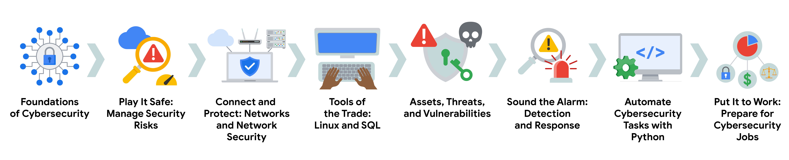

# Google Cybersecurity Certificate overview

> Hello, and welcome to the Google Cybersecurity Certificate! In this program, you will explore the growing field of cybersecurity, learn how cybersecurity is crucial to organizations and the people they serve, and develop relevant skills for a future career in the field. By completing the eight courses in this certificate program, you'll prepare for entry-level jobs in cybersecurity, such as cybersecurity analyst, security analyst, and security operations center (SOC) analyst. No prior experience in cybersecurity is required to complete this program.

## Google Cybersecurity Certificate courses

The Google Cybersecurity Certificate has eight courses that focus and build upon core concepts and skills related to the daily work of cybersecurity professionals, including foundational cybersecurity models and frameworks that are used to mitigate risk; protecting networks and data; using programming to automate tasks; identifying and responding to security incidents; and communicating and collaborating with stakeholders. Additionally, you will apply what you’ve learned in each course by completing portfolio projects that can be used to showcase your understanding of essential cybersecurity concepts to potential employers. The courses of the program are as follows:

- Foundations of Cybersecurity

- Play It Safe: Manage Security Risks
 
- Connect and Protect: Networks and Network Security
 
- Tools of the Trade: Linux and SQL
 
- Assets, Threats, and Vulnerabilities
 
- Sound the Alarm: Detection and Response

- Automate Cybersecurity Tasks with Python
 
- Put It to Work: Prepare for Cybersecurity Jobs

